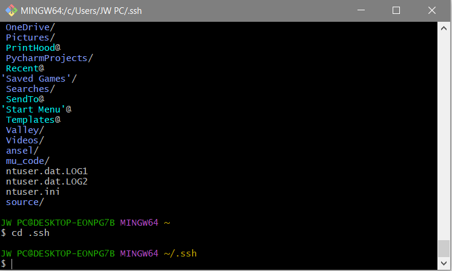
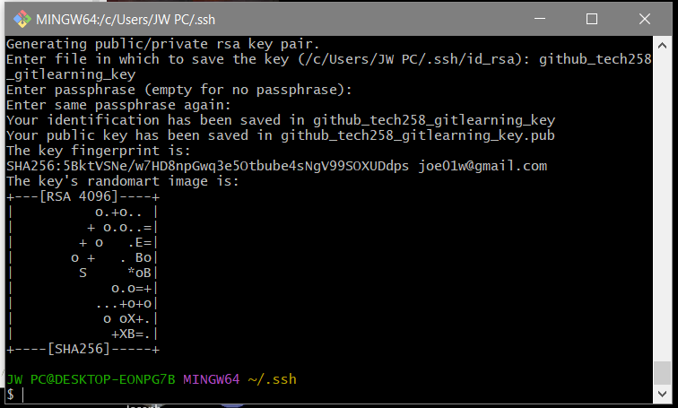
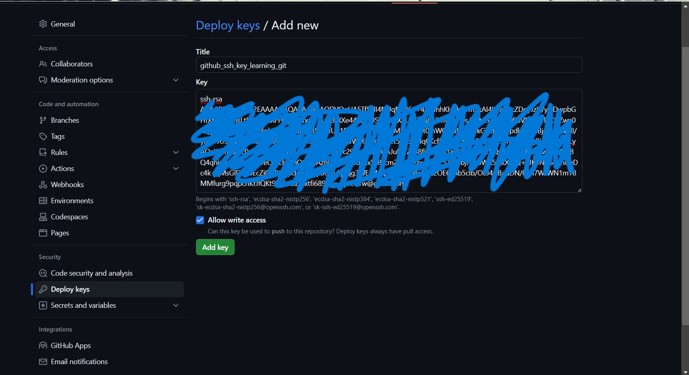
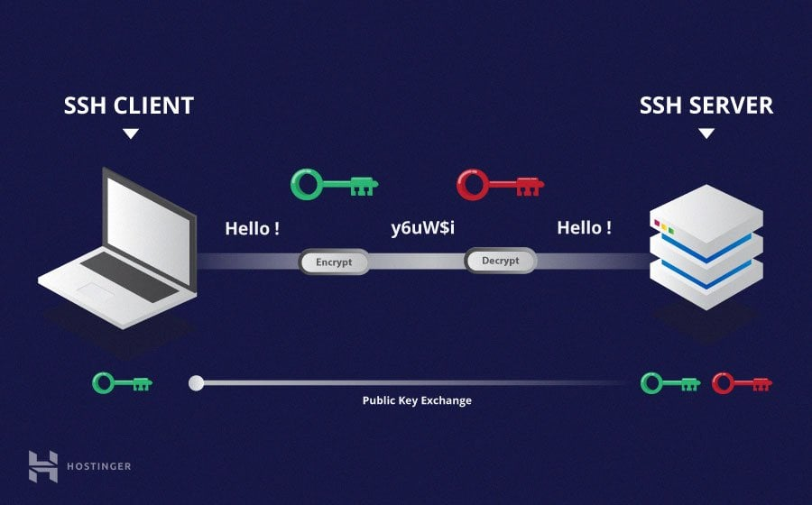

# Tech 258

## SSH with GitHub

### A guide on how make a github repo use SSH keys for authentication
<br>

#### Step 1: Go into the base repository *(use command `cd`)*.

#### Step 2: Use `cd .ssh` to enter that file.



#### Step 3:
Use the following command:
<br>`$ ssh-keygen -t rsa -b 4096 -C "joe01w@gmail.com"`
<BR> You enter the name you want to give the key.
<br> There will be a section for pass phrases, but you can skip this section.

#### Step 4:
Your terminal should look like this.
<br>

<br>
You can use the `ls` command to ensure that these 2 files were created. 
These are your keys, one is private (without .pub) and one is public (with .pub).

#### Step 5:
Use the command `cat` and the name of the public key file.
<br> For example: `cat github_tech258_gitlearning_key.pub`
<br> **MAKE SURE THIS HAS THE .PUB EXTENSION**
<BR> Your key will be outputted in the terminal. For example:
<br>
```
ssh-rsa AAAAB3NzaC1yc2EAAAADAQABAAACAQDVQgUA5Tf5HI4NUqN0861+4
MwhhKHTkA1mTkAI4UTa4BcZDoyJzH/yNDwpbGHfXhgImlghsLtPzit1uNXFHT
gYT8Txzkf+ulv8tRXe44ZlkoUSMj8ecX9UZQVg842mywWOs/KpbCQWIjUwPSV
N7SNTriOxZwn0X3jpbaXKfdubobwolqbCW/COdfCGBS3rdfUP1PxKH6wYUkfQ
7jMbdr8vGt0mWG4PBYPI7NkGN93zhppdkc8VUBjoUokLvp8/yizE+JU51QNac
H62oEkPiONSA6fGd0AkepnHq8JWT6RBnrt4xEt5Yy5+oIq0KcffuxElRPnFsv
EESIS5T5TnibOvWgPjoE9qI9B/LyAQaK/1mQTtc0a+59V+6UtSF0/OfQUJ5PL
WEFc29/qmLqxkUAJuE6rZFS8fiChI351taZ6bQCbm2BQuTPgEYg/8Yr+vx8HV
uItBQ4qhixtcuaa/kPThLveOhrLhYOiQO+2AzNzVYB6q40LBxYa8Tcm24h9Fe
zxoL+oL52FZybjPgL0WA5QkXWQ+xJK3NyG4qnouDc4k+qMsGID88bEcZiQXBO
Kpdmub9qt064jvPjnqg3WErJ45qSJUYGaD4eKRZ2OE67hb5clb/OeJ4zjBadD
N/01h7WJWN1mY8MMfurg9pqpchKfJfQKt9Xs5aUZJ/xtfi689Jw== joe01w@gmail.com
```
<br>When copy and pasting, ensure you do not have any white space.

#### Step 6:
Go to GitHub, go to the repository you are creating the key for, and enter settings.
<br>Go to Deploy Codes. Click on add deploy key.
<br>Add a name, and paste in the key from the previous step.
<br>**MAKE SURE YOU SELECT ALLOW WRITE ACCESS**
<br>Otherwise, you won't be able to push any updates to this repository.
Your page should look something like this:

<br>
#### Step 7: Click add key.

#### Step 8: Go to your repository you are creating the key for.

#### Step 9: Update Git Configuration:
If you've previously used HTTPS to clone repositories, you'll need to update the remote URLs to use SSH. Navigate to the local repository directory and use:

`git remote set-url origin git@github.com:username/repository.git`
<br>
Replace username with your GitHub username and repository with the name of your repository.

#### Step 10:Clone Repositories with SSH:
When cloning a repository, make sure to use the SSH URL. You can find this URL on the GitHub repository page by clicking the "Code" button and selecting "SSH".

Now, whenever you interact with your GitHub repositories via Git commands (push, pull, fetch, etc.), you'll be authenticated using your SSH key pair.

### SSH encryption diagram


